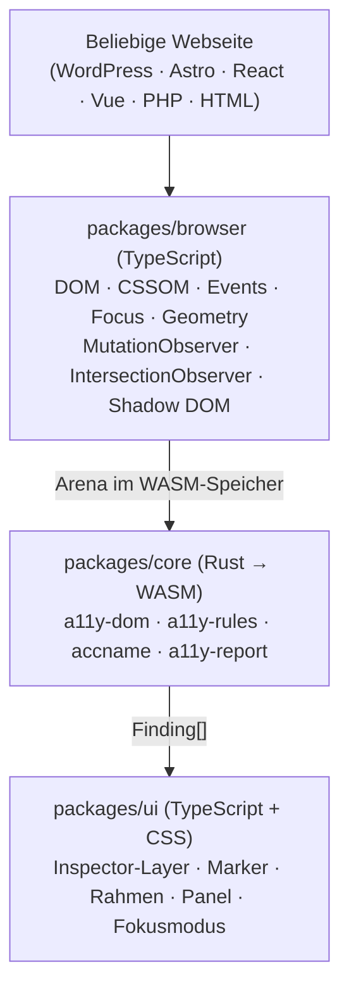
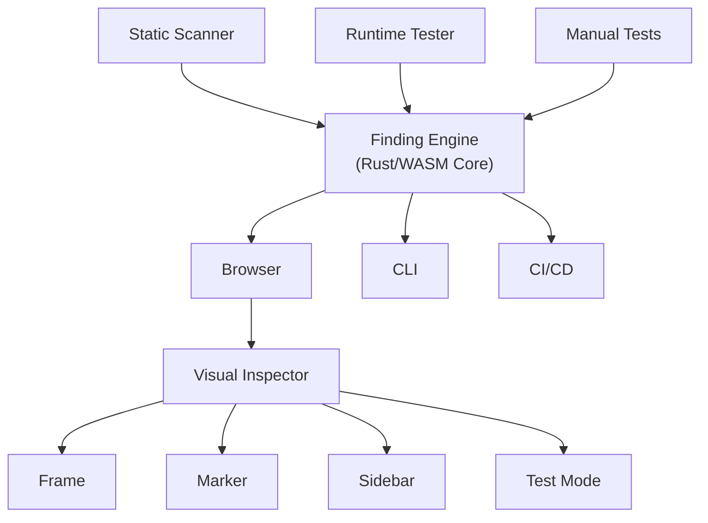

# Architecture — LiveAudit

> Status: Zielarchitektur für V1, noch nicht implementiert. Siehe
> [project-state.md](project-state.md).

## Pipeline

Drei-Schichten-Architektur. WASM ist die portable Analyse-Engine, TypeScript ist
die Schicht, die den Browser versteht — WASM selbst hat keinen Browser-Zugriff
(siehe [constraints.md](constraints.md)).



Der Rust-Core ist bewusst von der Browser-Welt entkoppelt, damit er später auch
in CLI oder CI/CD wiederverwendbar ist — vorgesehen, aber nicht Teil von V1.

## Paketstruktur

```
liveaudit/
packages/
├── core/     Rust → WASM
├── browser/  TypeScript
└── ui/       TypeScript + CSS
```

Build-Output: `dist/inspector.js`, `dist/inspector_bg.wasm`. Der Anwender bindet
nur `inspector.js` ein, das WASM lädt sich selbst nach.

`packages/core` enthält **keinen eigenen Regelbestand**. Es bindet die Crates aus
[a11y-core](https://github.com/casoon/a11y-core) ein und stellt nur den
Arena-Adapter und die wasm-bindgen-Grenze:

| Crate | Rolle | crates.io |
|---|---|---|
| `a11y-dom` | Baum-Traits und Fähigkeits-Tiers | [a11y-dom](https://crates.io/crates/a11y-dom) |
| `a11y-rules` | die Regeln selbst | [a11y-rules](https://crates.io/crates/a11y-rules) |
| `accname` | Accessible Name und Rolle | [accname](https://crates.io/crates/accname) |
| `a11y-report` | Finding- und Berichtsmodell | [a11y-report](https://crates.io/crates/a11y-report) |

Derselbe Bestand bedient astro-post-audit (Build-Zeit) und auditmysite
(CI/Crawl). Identische Rule-IDs über alle drei Oberflächen sind der Grund für den
Rust-Kern — siehe [decisions.md](decisions.md).

## Datenmodell: die Arena

Der Browser Adapter erzeugt keinen rohen DOM-Dump, sondern materialisiert den
Baum einmal als Arena im WASM-Linearspeicher. Darüber implementiert der Rust-Kern
`a11y_dom::Node` und `a11y_dom::Document`.

**Warum eine Arena und kein Callback-Modell:** WASM kann nicht pro Trait-Methode
nach JavaScript zurückrufen — jedes `children()` wäre ein FFI-Übergang. Der Baum
wird deshalb in einem Durchlauf übertragen und danach rein in Rust traversiert.

Die Übertragung läuft spaltenweise, nicht als Objektliste:

```
tag:          Uint32Array   internierte Tagnamen
parent:       Int32Array    Elternindex, -1 für die Wurzel
text_off/len: Uint32Array   Bereich im Blob
attr_start:   Uint32Array   Bereich in den Attributspalten (+1 Sentinel)
attr_name:    Uint32Array   internierte Attributnamen
attr_val_*:   Uint32Array   Bereich im Blob
blob:         Uint8Array    ein UTF-8-Puffer für alle Texte und Attributwerte
```

Gemessen (siehe [../spike/ERGEBNIS.md](../spike/ERGEBNIS.md)): Der Aufbau kostet
0,5 ms bei 31.000 Knoten und 3,8 ms bei 723.000. **Der Engpass ist nicht die
WASM-Grenze, sondern die DOM-Traversierung in JavaScript davor** — 79 ms bei
31.000 Knoten, rund 90 % der Gesamtzeit. Optimierungsarbeit gehört deshalb in den
Collector, nicht in die Serialisierung.

## Fähigkeits-Tiers

Die drei Oberflächen unterscheiden sich nicht darin, wie sie dieselben Daten
darstellen, sondern darin, **welche Daten es überhaupt gibt**:

| | statisches HTML | Chrome via CDP | LiveAudit (In-Page) |
|---|---|---|---|
| Struktur — Tags, Attribute, Text | ✓ | ✓ | ✓ |
| Semantik — Rolle, Accessible Name | berechnet | nativ | **berechnet** |
| Rendering — Stile, Geometrie | — | ✓ | ✓ |
| Interaktion — Fokus, Ereignisse | — | ✓ | ✓ (nativ, billig) |

Eine Regel, deren Tier der Host nicht bedient, liefert `UNTESTED` — nicht
Schweigen und nicht `PASS`.

**Wichtig für LiveAudit:** In-Page-JavaScript kommt **nicht** an den nativen
Accessibility-Tree. `getComputedRole`/`getComputedLabel` sind
WebDriver-Protokollbefehle, keine In-Page-APIs. Rolle und Accessible Name
berechnet deshalb das `accname`-Crate über der Arena.

## Analysephasen

Bei großen Seiten (5.000–100.000+ DOM-Nodes) ist ein Vollscan mit
`getComputedStyle()`/Bounding-Box pro Node zu teuer. Deshalb läuft die Analyse
gestaffelt:

1. **Phase 1 — Struktur** (billig, für alle Nodes): Tags, Attribute, Text, Hierarchie.
2. **Phase 2 — Accessibility Properties** (nur für relevante Elementtypen):
   `button, a, input, select, textarea, img, svg, video, audio, iframe, table,
   h1–h6, [role], [aria-*], [tabindex]`.
3. **Phase 3 — Rendering** (nur wenn eine Regel es konkret braucht):
   `getComputedStyle()`, `getBoundingClientRect()`, `elementFromPoint()` — z. B.
   für Kontrastprüfung.

## Rule Engine

Die Regeln kommen aus `a11y-rules` und sind freie generische Funktionen, pro Tier
registriert. `packages/core` wählt die Einstiegsfunktion nach dem, was der
Collector liefert:

```rust
// Nur Struktur
let report = a11y_rules::run(&arena);

// Struktur + Semantik (accname über der Arena)
let report = a11y_rules::run_with_semantics(&arena_mit_namen);
```

Beispiel-Finding:

```json
{
  "rule": "image-alt",
  "node": 183,
  "outcome": "fail",
  "severity": "error",
  "wcag": ["1.1.1"],
  "message": "Das Bild besitzt kein alt-Attribut."
}
```

`outcome` und `severity` sind getrennte Dimensionen: *wie sicher* ist die Aussage
gegenüber *wie schwer* wiegt das Problem. Eine dritte Achse `certainty` gibt es
bewusst nicht — eine nur heuristisch belegbare Regel liefert `outcome: review`
statt `fail` mit niedriger Gewissheit (siehe [decisions.md](decisions.md)).

## Element-Identität ohne DOM-Mutation

Der Scan schreibt keine Attribute in den untersuchten DOM (kein
`data-liveaudit-id="193"`), weil das die geprüfte Seite verändern würde.
Stattdessen hält der Adapter die Zuordnung im Speicher:

```typescript
const elementToId = new WeakMap<Element, number>();
const idToElement = new Map<number, Element>();
```

WASM liefert `nodeId`s in seinen Findings zurück, TypeScript löst sie über
`idToElement.get(nodeId)` auf das reale Element auf.

## Visualisierung

Die Visualisierung läuft als **Inspector-Layer** über der Seite, nicht als
Manipulation des geprüften Teilbaums. Bewusst nicht „Overlay" genannt: der Begriff
bezeichnet eine Kategorie von Werkzeugen, die die Seite zu *reparieren* vorgeben.
LiveAudit prüft und repariert nicht (siehe
[decisions.md](decisions.md)).

Das gesamte UI liegt in einem Shadow-DOM-Host:

```html
<liveaudit-inspector>
    #shadow-root
        ...
</liveaudit-inspector>
```

Der Shadow DOM isoliert das Tool von Seiten-CSS (WordPress-Theme, Bootstrap,
Tailwind, `!important`, wilde `z-index`-Regeln). Positionierung von Markierungen
läuft über `getBoundingClientRect()` + `position: fixed`, nie über
`element.style.border = ...` am Zielelement (das würde das Layout verändern).
Der Host ist `pointer-events: none`; nur Marker und Panel setzen
`pointer-events: auto`.

Vier Darstellungsvarianten:

1. **Rahmen** — für größere Elemente (z. B. Button ohne Accessible Name):
   Rechteck im Layer, deckungsgleich mit `getBoundingClientRect()` des Zielelements.
2. **Marker** — für kleine Elemente (z. B. Icons): nummerierter Punkt, Klick öffnet
   ein Popover mit Erklärung, WCAG-Referenz, Code-Ausschnitt und
   `[Element] [Details]`-Aktionen.
3. **Seitenleiste** — Fehlerliste gruppiert nach Kategorie (Struktur, Bilder,
   Formulare, ARIA, Tastatur, Kontrast, …). Klick auf ein Finding:
   `element.scrollIntoView({ behavior: "smooth", block: "center" })` gefolgt von
   Marker-Anzeige. Das verbindet Report und reale Seite.
4. **Fokusreihenfolge** — nummerierte Marker über der tatsächlichen Tab-Reihenfolge,
   inkl. Auflistung der `tabindex`-Werte, um Fälle wie `tabindex="4"` neben
   `tabindex="12"` oder unsichtbare fokussierbare Elemente sichtbar zu machen.

## Live-Modus

Moderne Seiten (React/Vue/Astro Islands) verändern ihren DOM laufend. Ein
`MutationObserver` beobachtet das und löst nach einem Debounce von 200 ms einen
Re-Scan der neuen Nodes aus (nicht der gesamten Seite).

## Langfristige Architektur



## V1-Scope

Für V1 bewusst klein: TypeScript DOM Collector → Arena →
Rust/WASM Rule Engine → `Finding[]` → TypeScript Inspector-Layer mit Rahmen/Marker und
Seitenpanel. Dazu ca. 20 deterministische Regeln für HTML, ARIA, Formulare,
Bilder und Struktur; der Katalog steht in `a11y-rules`. Kontrast,
Fokus-/Tab-Reihenfolge, Live-Modus, interaktive Tests und CLI/CI kommen erst
danach dazu.
